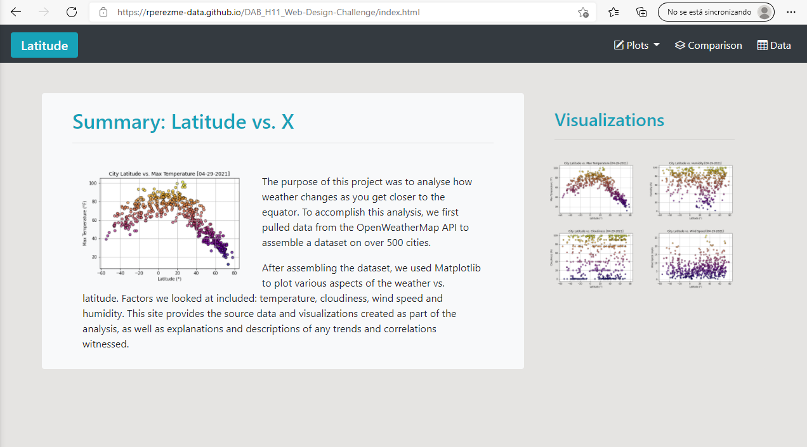

# Web-Design-Challenge
## Visualization Dashboard Website

### Description
The scope of this project is to create a visualization dashboard website displaying weather data created in a previous project (WeatherPy). There is a landing page to summarize the dashboard, a comparison page to showcase all of the plots and a data page displaying the data used in the project. Individual pages for each plot were created, containing the visualizations and their corresponding explanations. 

### Script Summary
This website was built using HTML & Bootstrap 5 to provide a responsive behavior taking advantage of the grid-container-row-column model as well as utilities, components and icons.

### Features

### Screenshot

### [Experience the Dashboard!](https://rperezme-data.github.io/DAB_H11_Web-Design-Challenge/index.html)